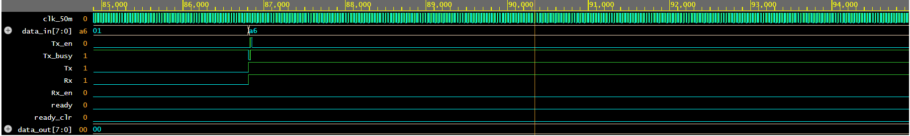
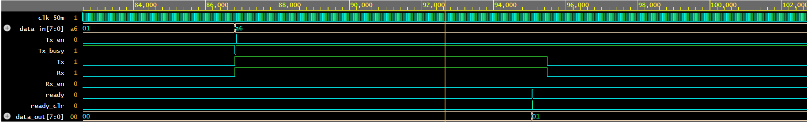
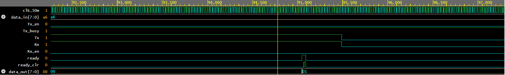

# UART Layered Verification Testbench

A layered SystemVerilog verification environment developed to verify a UART IP core using constrained-random verification, self-checking scoreboards, functional coverage, and SystemVerilog Assertions (SVA).


## Project Objective

The goal of this project was to build a modular verification environment from scratch without using UVM and verify UART functionality using industry-standard verification concepts such as:

- Transaction-based stimulus generation
- Layered testbench architecture
- Mailbox-based communication
- Self-checking scoreboards
- Functional coverage
- SystemVerilog Assertions (SVA)


## DUT

UART RTL from:

https://github.com/LasiduDilshan/UART-using-Verilog

### DUT Features

- UART Transmitter
- UART Receiver
- 50 MHz System Clock
- 115200 Baud Rate
- 16x RX Oversampling
- Ready/Ready_Clear Handshake


## Verification Environment Architecture

```text
                 +-------------+
                 | Generator   |
                 +-------------+
                        |
                        | mailbox
                        v
                 +-------------+
                 | Driver      |
                 +-------------+
                        |
                        v
                 +-------------+
                 | UART DUT    |
                 +-------------+
                        |
                        v
                 +-------------+
                 | Monitor     |
                 +-------------+
                        |
                        | mailbox
                        v
                 +-------------+
                 | Scoreboard  |
                 +-------------+
```

### Components

| File              | Description |
|-------------------|-------------|
| interface.sv      | UART interface signals |
| transaction.sv    | Randomized transaction object |
| generator.sv      | Constrained-random stimulus generation |
| driver.sv         | Drives transactions into DUT |
| monitor.sv        | Captures received UART data |
| scoreboard.sv     | Compares expected and actual data |
| assertions.sv     | SystemVerilog Assertions |
| testbench.sv      | Top-level integration |


## Communication Flow

```text
Generator --> Driver

Generator --> Scoreboard (Expected Data)

Monitor --> Scoreboard (Actual Data)

Communication is implemented using SystemVerilog mailboxes.


```
## Verification Methodology

### Loopback Testing

The UART transmitter output is connected directly to the receiver input:

```systemverilog
assign vif.Rx = vif.Tx;
```

This allows automatic verification of transmitted and received data.

---

### Constrained-Random Verification

Random 8-bit transactions are generated:

```systemverilog
rand bit [7:0] data;
```

The generator creates randomized UART packets and sends them to the driver and scoreboard.

---

### Self-Checking Scoreboard

Expected and actual transactions are compared automatically:

```text
Expected Data = A5
Actual Data   = A5

PASS
```

No manual waveform inspection is required to determine correctness.

---

## Functional Coverage

Coverage was implemented on generated UART data values.

### Coverage Bins

- 0x00
- 0xFF
- Low-range values
- Mid-range values
- High-range values

### Results

| Metric                    | Result |
|---------------------------|--------|
| Transactions Generated    | 1000 |
| Functional Coverage       | 100% |

Coverage was collected using SystemVerilog covergroups.

---

## SystemVerilog Assertions

The following protocol assertions were implemented:

### 1. Transmission Starts After Enable

```systemverilog
property tx_start;
  @(posedge vif.clk_50m)
  vif.Tx_en |=> vif.Tx_busy;
endproperty
```

Checks that the transmitter becomes busy after a transmit request.

---

### 2. Ready Indicates Valid Data

```systemverilog
property valid_data;
  @(posedge vif.clk_50m)
  vif.ready |-> !$isunknown(vif.data_out);
endproperty
```

Checks that valid data is available whenever the receiver asserts ready.

---

### Assertion Results

| Assertion   | Result |
|-------------|--------|
| tx_start    | PASS |
| valid_data  | PASS |

No assertion failures were observed across all 1000 transactions.

---

## Simulation Results

### Test Configuration

| Parameter         | Value |
|-------------------|-------|
| Clock Frequency   | 50 MHz |
| Baud Rate         | 115200 |
| Transactions      | 1000 |

### Results

- All transactions passed scoreboard comparison
- 100% functional coverage achieved
- All assertions passed
- Successful UART loopback verification
- Verified back-to-back transactions

---

## Sample Simulation Log

```text
(generator) Generated data = dc

(driver) Driving data = dc

(monitor) Received data = dc

(scoreboard) Expected data = dc, Actual data = dc

PASS
```

---

## Waveform

The waveform demonstrates:

- Tx_en pulse generation
- Tx_busy assertion
- UART transmission
- UART reception
- Ready handshake
- Ready_Clear handshake
- Correct reconstruction of received data







---

## Tools Used

- SystemVerilog
- Synopsys VCS
- EDA Playground
- EPWave

---

## Skills Demonstrated

- SystemVerilog OOP
- Layered Verification Architecture
- Virtual Interfaces
- Mailboxes
- Constrained-Random Verification
- Functional Coverage
- SystemVerilog Assertions (SVA)
- Self-Checking Scoreboards
- UART Protocol Verification
- Waveform Debugging

---

## Future Improvements

- Parameterized baud-rate verification
- Error injection testing
- Parity-bit verification
- Functional coverage crosses
- UVM migration
- Coverage-driven stimulus generation
